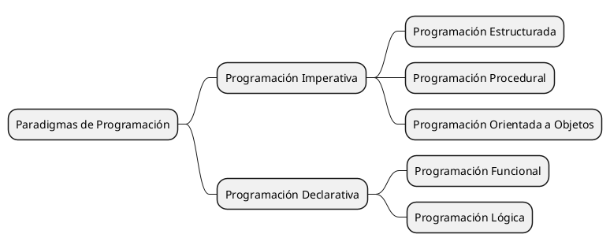

# Clasificación por Paradigmas de Programación

Antes que nada, ¿qué es un paradigma de programación?

Un **paradigma de programación** es un estilo de programación que proporciona una estructura y un conjunto de reglas
para escribir programas de computadora. Los paradigmas de programación definen la forma en que se estructuran y
comportan los programas, y proporcionan un conjunto de herramientas y técnicas para resolver problemas de programación.

Existen varios paradigmas de programación, cada uno con sus propias características y ventajas. Algunos de los
paradigmas de programación más comunes son:

1. **Programación Imperativa**: Este paradigma se basa en la ejecución de instrucciones secuenciales que modifican el
   estado de las variables. Los programas escritos en este paradigma se componen de una serie de instrucciones que
   describen cómo se deben realizar las operaciones.
2. **Programación Declarativa**: Este paradigma se basa en la descripción de las relaciones entre los datos y las
   operaciones que se deben realizar sobre ellos, en lugar de describir los pasos para realizar las operaciones.

Estos dos no solo son los más comunes, sino que también son los más importantes y la base de muchos otros paradigmas
de programación. Entendamoslos con el siguiente mapa mental:

## Programación Imperativa

La **programación imperativa** es un paradigma de programación que se basa en la ejecución de instrucciones secuenciales
que modifican el estado de las variables. Los programas escritos en este paradigma se componen de una serie de
instrucciones que describen cómo se deben realizar las operaciones.

### Ejemplo de lenguajes de programación imperativa

Algunos ejemplos de lenguajes de programación imperativa son:

- **C**: Un lenguaje de programación de bajo nivel que se utiliza para programar sistemas operativos y aplicaciones de
  alto rendimiento.
- **Java**: Un lenguaje de programación de alto nivel que se utiliza para desarrollar aplicaciones empresariales y
  aplicaciones web.
- **Python**: Un lenguaje de programación de alto nivel que se utiliza para desarrollar aplicaciones web, aplicaciones
  científicas y análisis de datos.
- **JavaScript**: Un lenguaje de programación de alto nivel que se utiliza para desarrollar aplicaciones web y
  aplicaciones móviles.

### Programación Estructurada

La **programación estructurada** es un estilo de programación imperativa que se basa en la división de un programa en
bloques de código más pequeños y manejables. Los programas escritos en este estilo se componen de una serie de
instrucciones secuenciales que se organizan en estructuras de control como bucles y condicionales.

#### Ejemplo de lenguajes de programación estructurada

Algunos ejemplos de lenguajes de programación estructurada son:

- **C**: Un lenguaje de programación de bajo nivel que se utiliza para programar sistemas operativos y aplicaciones de
  alto rendimiento.
- **Pascal**: Un lenguaje de programación de alto nivel que se utiliza para enseñar programación y desarrollar
  aplicaciones científicas y educativas.
- **Fortran**: Un lenguaje de programación de alto nivel que se utiliza para programar aplicaciones científicas y
  matemáticas.
- **COBOL**: Un lenguaje de programación de alto nivel que se utiliza para programar aplicaciones empresariales y
  sistemas de información.

### Programación Orientada a Objetos

La **programación orientada a objetos** es un estilo de programación imperativa que se basa en la creación de objetos
que contienen datos y métodos que operan sobre esos datos. Los programas escritos en este estilo se componen de una
serie de clases y objetos que representan entidades del mundo real y sus interacciones.

#### Ejemplo de lenguajes de programación orientada a objetos

Algunos ejemplos de lenguajes de programación orientada a objetos son:

- **Java**: Un lenguaje de programación de alto nivel que se utiliza para desarrollar aplicaciones empresariales y
  aplicaciones web.
- **C++**: Un lenguaje de programación de alto nivel que se utiliza para programar sistemas operativos y aplicaciones de
  alto rendimiento.
- **Python**: Un lenguaje de programación de alto nivel que se utiliza para desarrollar aplicaciones web, aplicaciones
  científicas y análisis de datos.
- **C#**: Un lenguaje de programación de alto nivel que se utiliza para desarrollar aplicaciones empresariales y
  aplicaciones web.

### Programación Orientada a Eventos

La **programación orientada a eventos** es un estilo de programación imperativa que se basa en la creación de eventos y
manejadores de eventos que responden a las interacciones del usuario con la interfaz de usuario de una aplicación. Los
programas escritos en este estilo se componen de una serie de eventos y manejadores de eventos que controlan la

#### Ejemplo de lenguajes de programación orientada a eventos

Algunos ejemplos de lenguajes de programación orientada a eventos son:

- **JavaScript**: Un lenguaje de programación de alto nivel que se utiliza para desarrollar aplicaciones web y
  aplicaciones móviles.
- **Visual Basic**: Un lenguaje de programación de alto nivel que se utiliza para desarrollar aplicaciones de escritorio
  y aplicaciones empresariales.
- **C#**: Un lenguaje de programación de alto nivel que se utiliza para desarrollar aplicaciones empresariales y
  aplicaciones web.

### Programación Orientada a Aspectos

La **programación orientada a aspectos** es un estilo de programación imperativa que se basa en la separación de las
preocupaciones de un programa en aspectos que se pueden encapsular y reutilizar en diferentes partes del programa. Los
programas escritos en este estilo se componen de una serie de aspectos que se pueden aplicar a diferentes partes del
programa para mejorar su modularidad y mantenibilidad.

#### Ejemplo de lenguajes de programación orientada a aspectos

Algunos ejemplos de lenguajes de programación orientada a aspectos son:

- **AspectJ**: Un lenguaje de programación de alto nivel que se utiliza para programar aspectos en aplicaciones Java.
- **Spring AOP**: Un marco de programación de alto nivel que se utiliza para programar aspectos en aplicaciones Java.
- **PostSharp**: Un marco de programación de alto nivel que se utiliza para programar aspectos en aplicaciones .NET.
- **AspectC++**: Un lenguaje de programación de alto nivel que se utiliza para programar aspectos en aplicaciones C++.
- **AspectC**: Un lenguaje de programación de alto nivel que se utiliza para programar aspectos en aplicaciones C.
- **AspectS**: Un lenguaje de programación de alto nivel que se utiliza para programar aspectos en aplicaciones S.

## Programación Declarativa

La **programación declarativa** es un paradigma de programación que se basa en la descripción de las relaciones entre
los datos y las operaciones que se deben realizar sobre ellos, en lugar de describir los pasos para realizar las
operaciones. Los programas escritos en este paradigma se componen de una serie de declaraciones que describen qué se
debe hacer, en lugar de cómo se debe hacer.

### Ejemplo de lenguajes de programación declarativa

Algunos ejemplos de lenguajes de programación declarativa son:

- **Prolog**: Un lenguaje de programación de alto nivel que se utiliza para programar sistemas de inteligencia
  artificial
  y lógica.
- **Haskell**: Un lenguaje de programación de alto nivel que se utiliza para programar aplicaciones funcionales y
  matemáticas.

### Programación Funcional

La **programación funcional** es un estilo de programación declarativa que se basa en la aplicación de funciones
matemáticas puras para resolver problemas de programación. Los programas escritos en este estilo se componen de una
serie de funciones que toman datos de entrada y devuelven datos de salida, sin modificar el estado de las variables.

#### Ejemplo de lenguajes de programación funcional

Algunos ejemplos de lenguajes de programación funcional son:

- **Haskell**: Un lenguaje de programación de alto nivel que se utiliza para programar aplicaciones funcionales y
  matemáticas.
- **Erlang**: Un lenguaje de programación de alto nivel que se utiliza para programar sistemas distribuidos y
  concurrentes.
- **Clojure**: Un lenguaje de programación de alto nivel que se utiliza para programar aplicaciones web y análisis de
  datos.
- **Scala**: Un lenguaje de programación de alto nivel que se utiliza para programar aplicaciones empresariales y
  aplicaciones web.
- **F#**: Un lenguaje de programación de alto nivel que se utiliza para programar aplicaciones empresariales y
  aplicaciones web.
- **OCaml**: Un lenguaje de programación de alto nivel que se utiliza para programar aplicaciones científicas y
  matemáticas.

### Programación Lógica

La **programación lógica** es un estilo de programación declarativa que se basa en la aplicación de reglas lógicas para
resolver problemas de programación. Los programas escritos en este estilo se componen de una serie de reglas lógicas que
definen las relaciones entre los datos y las operaciones que se deben realizar sobre ellos.

#### Ejemplo de lenguajes de programación lógica

Algunos ejemplos de lenguajes de programación lógica son:

- **Prolog**: Un lenguaje de programación de alto nivel que se utiliza para programar sistemas de inteligencia
  artificial
  y lógica.
- **Datalog**: Un lenguaje de programación de alto nivel que se utiliza para programar sistemas de bases de datos y
  lógica.
- **Mercury**: Un lenguaje de programación de alto nivel que se utiliza para programar sistemas de lógica y
  programación funcional.

## Conclusión

Los paradigmas de programación son estilos de programación que proporcionan una estructura y un conjunto de reglas para
escribir programas de computadora. Cada paradigma tiene sus propias características y ventajas, y se puede utilizar para
resolver diferentes tipos de problemas de programación.

Es importante tener en cuenta que no existe un paradigma de programación "mejor" que los demás, ya que cada uno tiene
sus propias fortalezas y debilidades. La elección del paradigma de programación adecuado dependerá del tipo de problema
que se esté tratando de resolver y de las preferencias del programador.

En resumen, los paradigmas de programación son una herramienta poderosa que los programadores pueden utilizar para
escribir programas de computadora de manera efectiva y eficiente. Al comprender los diferentes paradigmas de
programación y sus características, los programadores pueden elegir el enfoque adecuado para cada problema de
programación y mejorar la calidad y la eficiencia de sus programas.