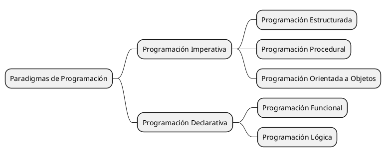

# Clasificación por Paradigmas de Programación

Antes que nada, ¿qué es un paradigma de programación?

Un **paradigma de programación** es un estilo de programación que proporciona una estructura y un conjunto de reglas
para escribir programas de computadora. Los paradigmas de programación definen la forma en que se estructuran y
comportan los programas, y proporcionan un conjunto de herramientas y técnicas para resolver problemas de programación.

Existen varios paradigmas de programación, cada uno con sus propias características y ventajas. Algunos de los
paradigmas de programación más comunes son:

1. **Programación Imperativa**: Este paradigma se basa en la ejecución de instrucciones secuenciales que modifican el
   estado de las variables. Los programas escritos en este paradigma se componen de una serie de instrucciones que
   describen cómo se deben realizar las operaciones.
2. **Programación Declarativa**: Este paradigma se basa en la descripción de las relaciones entre los datos y las
   operaciones que se deben realizar sobre ellos, en lugar de describir los pasos para realizar las operaciones.

Estos dos no solo son los más comunes, sino que también son los más importantes y la base de muchos otros paradigmas
de programación. Entendamoslos con el siguiente mapa mental:

