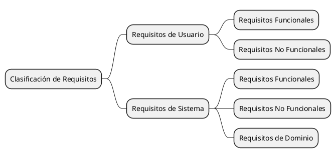

# Requisitos de Software

Los **requisitos de software** son las especificaciones funcionales y no funcionales que definen las características,
funcionalidades y restricciones de un sistema de software. Estos requisitos son la base para el diseño, desarrollo,
implementación y prueba de un sistema de software, y son fundamentales para garantizar que el sistema cumpla con las
necesidades y expectativas de los usuarios y las partes interesadas.

## Tipos de Requisitos de Software

Los requisitos de software se pueden clasificar de la siguiente manera:

* **Requisitos de Usuario**: Son los requisitos que describen las necesidades y expectativas de los usuarios finales
  del sistema de software. Estos requisitos se centran en las funcionalidades y características que los usuarios desean
  ver en el sistema, y son fundamentales para garantizar la satisfacción del cliente y la usabilidad del sistema.
* **Requisitos de Sistema**: Son los requisitos que describen las características y funcionalidades del sistema de
  software en su conjunto. Estos requisitos se centran en los aspectos técnicos y de rendimiento del sistema, y son
  fundamentales para garantizar que el sistema funcione de manera eficiente y efectiva.

A su vez, los requisitos de usuario y sistema se dividen en:

* **Requisitos Funcionales**: Son los requisitos que describen las funciones y operaciones que el sistema debe realizar.
  Estos requisitos se centran en las acciones y comportamientos del sistema, y son fundamentales para garantizar que el
  sistema cumpla con las necesidades y expectativas de los usuarios.
* **Requisitos No Funcionales**: Son los requisitos que describen las restricciones y limitaciones del sistema, como
  rendimiento, seguridad, usabilidad, mantenibilidad y escalabilidad. Estos requisitos se centran en los atributos de
  calidad del sistema, y son fundamentales para garantizar que el sistema cumpla con los estándares y normas de calidad
  establecidos.

> En particular los requisitos de sistema incluyen los **Requisitos de Dominio**, que son los requisitos que describen
> las características y funcionalidades específicas del dominio de aplicación del sistema. Estos requisitos se centran
> en los aspectos y restricciones del dominio de aplicación, y son fundamentales para garantizar que el sistema cumpla
> con los requisitos y estándares del dominio.

Mientras tanto los requisitos funcionales se dividen en:

- **Requisitos de Producto**: Son los requisitos que describen las características y funcionalidades específicas del
  producto de software. Estos requisitos se centran en las capacidades y comportamientos del producto, y son
  fundamentales para garantizar que el producto cumpla con las necesidades y expectativas de los usuarios.
- **Requisitos Organizacionales**: Son los requisitos que describen las políticas, procedimientos y estándares
  organizacionales que el sistema debe cumplir. Estos requisitos se centran en los requisitos y restricciones
  organizacionales, y son fundamentales para garantizar que el sistema cumpla con los requisitos y normas de la
  organización.
- **Requisitos Externos**: Son los requisitos que describen las interfaces y dependencias externas del sistema. Estos
  requisitos se centran en las interacciones y conexiones del sistema con otros sistemas y entidades externas, y son
  fundamentales para garantizar la interoperabilidad y compatibilidad del sistema.
- **Requisitos Internos**: Son los requisitos que describen la estructura y diseño internos del sistema. Estos
  requisitos se centran en la arquitectura y componentes internos del sistema, y son fundamentales para garantizar la
  coherencia y mantenibilidad del sistema.

## Tipos de Requerimientos por su persistencia

Los requisitos de software pueden clasificarse según su persistencia en:

* **Requisitos Volátiles**: Son los requisitos que pueden cambiar con el tiempo debido a cambios en las necesidades y
  expectativas de los usuarios y las partes interesadas. Estos requisitos son flexibles y adaptables, y pueden
  modificarse durante el ciclo de vida del proyecto.
* **Requisitos Estables o Duraderos**: Son los requisitos que permanecen constantes a lo largo del ciclo de vida del
  proyecto debido a su naturaleza y características. Estos requisitos son fijos y no cambian con el tiempo, y son
  fundamentales para garantizar la estabilidad y consistencia del sistema.

## Importancia de los Requisitos de Software

Los requisitos de software son fundamentales para el éxito de un proyecto de software, ya que:

* **Definen el Alcance del Proyecto**: Los requisitos de software establecen los límites y objetivos del proyecto,
  proporcionando una guía clara para el diseño, desarrollo e implementación del sistema de software.
* **Garantizan la Satisfacción del Cliente**: Los requisitos de software aseguran que el sistema cumpla con las
  necesidades y expectativas de los usuarios y las partes interesadas, garantizando la satisfacción del cliente.
* **Facilitan la Comunicación y Colaboración**: Los requisitos de software promueven la comunicación y colaboración
  entre los miembros del equipo de desarrollo, los interesados y las partes interesadas, facilitando la comprensión y
  el consenso sobre las características y funcionalidades del sistema.
* **Orientan la Toma de Decisiones**: Los requisitos de software proporcionan una base sólida para la toma de decisiones
  sobre el diseño, desarrollo e implementación del sistema, permitiendo a los responsables del proyecto planificar,
  organizar y dirigir las actividades del proyecto de manera efectiva.
* **Minimizan los Errores y Problemas**: Los requisitos de software ayudan a identificar y corregir los errores y
  problemas del sistema durante el ciclo de vida del proyecto, minimizando los riesgos y costos asociados con el
  desarrollo de software.
* **Facilitan la Evaluación y Validación**: Los requisitos de software permiten evaluar y validar el sistema de software
  en función de los criterios y estándares establecidos, garantizando la calidad y eficacia del sistema.
* **Promueven la Calidad y Eficiencia**: Los requisitos de software fomentan la calidad y eficiencia del sistema de
  software al establecer estándares y normas de calidad para el diseño, desarrollo e implementación del sistema.

## Conclusión

Los requisitos de software son la base para el diseño, desarrollo e implementación de un sistema de software, y son
fundamentales para garantizar que el sistema cumpla con las necesidades y expectativas de los usuarios y las partes
interesadas. Al definir y gestionar los requisitos de software de manera efectiva, los responsables del proyecto pueden
garantizar el éxito y la eficacia del proyecto de software, y cumplir con los objetivos y requisitos del negocio.