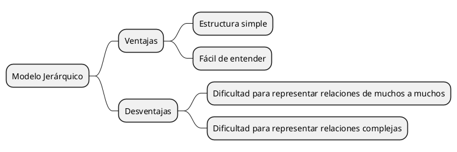
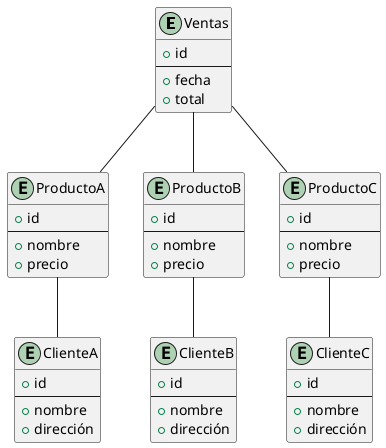
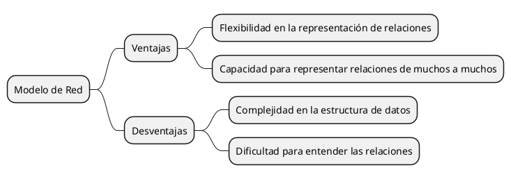
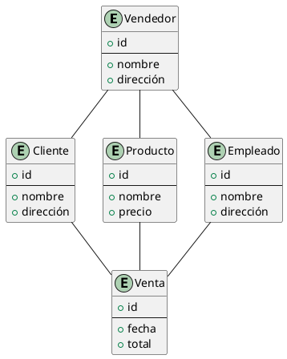
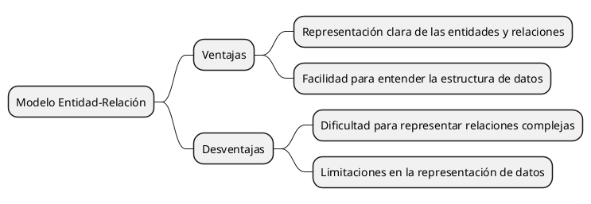
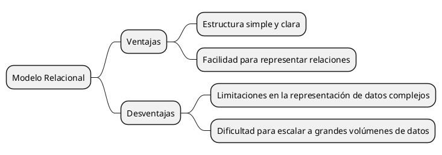
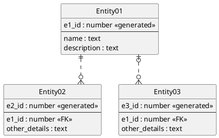
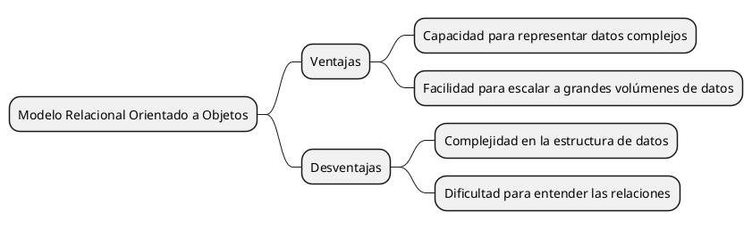
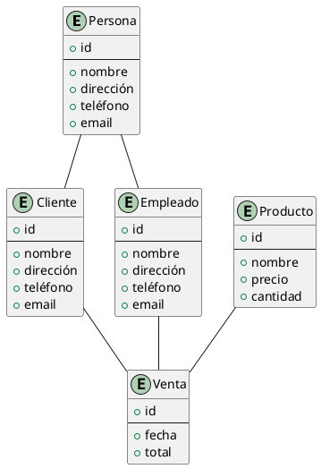

# Modelos SQL

Los modelos SQL (Structured Query Language) son modelos de bases de datos que utilizan un lenguaje de consulta
estructurado (SQL) para interactuar con la base de datos. Estos modelos se basan en tablas, donde cada tabla representa
una entidad y cada fila de la tabla representa una instancia de esa entidad. Los modelos SQL son adecuados para
representar relaciones de uno a uno, uno a muchos y muchos a muchos.

Los modelos SQL más representativos son:

### Modelo Jerárquico

El modelo jerárquico es un modelo de base de datos en el que los datos se organizan en forma de árbol, donde cada nodo
tiene un único padre y varios hijos. Este modelo es adecuado para representar relaciones de uno a muchos.

### Ejemplo de Modelo Jerárquico

### Modelo de Red

El modelo de red es un modelo de base de datos en el que los datos se organizan en forma de grafo, donde cada nodo puede
tener varios padres y varios hijos. Este modelo es adecuado para representar relaciones de muchos a muchos.

### Ejemplo de Modelo de Red

### Modelo Entidad-Relación

El modelo entidad-relación es un modelo de base de datos en el que los datos se organizan en forma de entidades y
relaciones. Cada entidad tiene atributos que describen sus propiedades, y cada relación describe la forma en que las
entidades se relacionan entre sí.

### Ejemplo de Modelo Entidad-Relación

{display=block}

{display=block}

### Modelo Relacional

El modelo relacional es un modelo de base de datos en el que los datos se organizan en tablas, donde cada tabla tiene
una clave primaria que identifica de forma única cada fila de la tabla. Este modelo es adecuado para representar
relaciones de uno a uno, uno a muchos y muchos a muchos.

### Ejemplo de Modelo Relacional

{display=block}

### Modelo Relacional Orientado a Objetos

El modelo relacional orientado a objetos es un modelo de base de datos que combina las características del modelo
relacional y del modelo orientado a objetos. En este modelo, los datos se organizan en tablas, pero cada tabla puede
contener atributos complejos, como listas o conjuntos.

### Ejemplo de Modelo Relacional Orientado a Objetos

